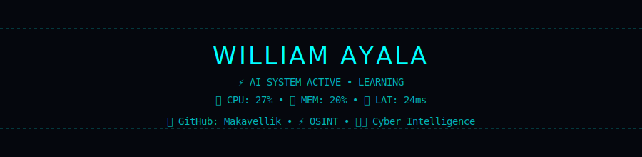
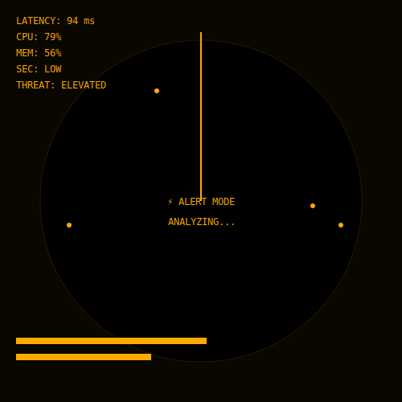
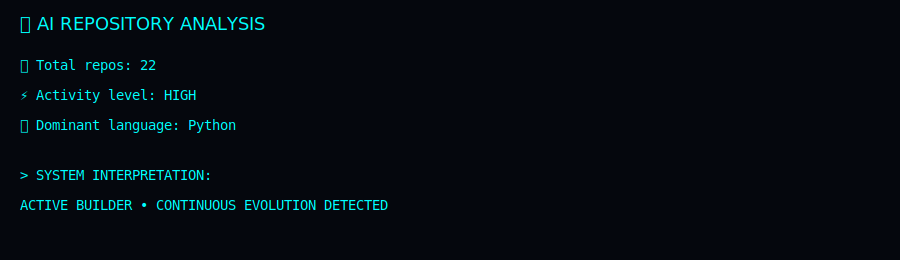

<p align="center">
  
</p>

<div align="center">

<!-- HEADER -->

<div style="background: radial-gradient(circle at top, #0f0f0f, #050505); padding:30px; border-radius:16px; border:1px solid #1a1a1a; box-shadow: 0 0 40px rgba(0,255,225,0.08);">

<h1 style="color:#00ffe1; font-size:2.2em; text-shadow:0 0 12px #00ffe1, 0 0 25px rgba(0,255,225,0.5);">
💀 New Era · OSINT & Forensic Architect 💀
</h1>

<h3 style="color:#ff6ec7; text-shadow:0 0 10px #ff6ec7;">
🔍 Explorador Digital · Defensor Forense · Arquitecto de Señales
</h3>

<p style="color:#b8b8b8; max-width:650px; margin:auto; line-height:1.6;">
Analista de infraestructura, comportamiento y seguridad web.<br>
Fusionando observación pasiva, inteligencia quirúrgica y técnicas defensivas avanzadas.<br><br>
<span style="color:#00ffe1;">No intrusión.</span> 
<span style="color:#ff6ec7;">No destrucción.</span> 
<span style="color:#ffffff;">Solo visión y control.</span>
</p>

</div>

</div>

---

## 🧠 Filosofía

<div align="center">

> <span style="color:#00ffe1; font-size:1.1em;">

“Observar, correlacionar y entender.
Sin explotar, sin ruido, solo señal pura.” </span>

</div>

<br>

```diff
+ Análisis pasivo y seguro de infraestructuras digitales
+ Observación consciente de backend y frontend
+ Heurística avanzada para riesgos, phishing y fraude web
+ OSINT forense con interpretación quirúrgica de señales
```

---
<br>

<div align="center">

<span style="color:#ff6ec7; text-shadow:0 0 8px #ff6ec7;">
⚡ Todas las herramientas siguen un mismo principio:
</span><br><br>

<span style="color:#00ffe1;">Observación consciente</span> · <span style="color:#ffffff;">Análisis defensivo</span> · <span style="color:#ff6ec7;">Precisión quirúrgica</span>

</div>

---

## 💡 Especialidades

```yaml
- OSINT Forense Avanzado:
    Extracción de información sin dejar huella

- Análisis de Infraestructura:
    Mapas de red, endpoints y comportamiento de sistemas

- Seguridad y Auditoría:
    Evaluación pasiva de vulnerabilidades

- Interpretación de Señales:
    Correlación avanzada backend + frontend
```

---

## 🔗 Contacto Digital

<div align="center">

🌐 GitHub → https://github.com/Makavellik
📡 Telegram → @DonMakveliw

</div>

---

<div align="center">

<h2 style="color:#ff6ec7; text-shadow:0 0 12px #ff6ec7, 0 0 25px rgba(255,110,199,0.6);">
💥 Observa · Analiza · Domina 💥
</h2>

</div>


<p align="center">
  
</p>

<p align="center">
  
</p>

<p align="center">
  
</p>

<div align="center" style="background:#04060a; padding:20px; border-radius:12px; font-family: monospace; color:#00ffff; box-shadow: 0 0 20px #00ffff;">
  <h2 style="color:#00ffff; text-shadow:0 0 8px #00ffff; margin-bottom:15px;">
    ⚡ TACTICAL REPOSITORY ACCESS
  </h2>

  <ul style="list-style:none; padding-left:0; margin:0; font-size:16px;">
    <li style="margin:10px 0;">
      <a href="https://github.com/Makavellik/OsintInverso" target="_blank" 
         style="color:#00ffff; text-decoration:none; transition:0.3s; text-shadow:0 0 4px #00ffff;"
         onmouseover="this.style.color='#ffffff'; this.style.textShadow='0 0 12px #00ffff';"
         onmouseout="this.style.color='#00ffff'; this.style.textShadow='0 0 4px #00ffff';">
         ▶ OsintInverso
      </a>
    </li>
    <li style="margin:10px 0;">
      <a href="https://github.com/Makavellik/Observador-X-Ray" target="_blank" 
         style="color:#00ffff; text-decoration:none; transition:0.3s; text-shadow:0 0 4px #00ffff;"
         onmouseover="this.style.color='#ffffff'; this.style.textShadow='0 0 12px #00ffff';"
         onmouseout="this.style.color='#00ffff'; this.style.textShadow='0 0 4px #00ffff';">
         ▶ Observador-X-Ray
      </a>
    </li>
    <li style="margin:10px 0;">
      <a href="https://github.com/Makavellik/OsintSignalsF" target="_blank" 
         style="color:#00ffff; text-decoration:none; transition:0.3s; text-shadow:0 0 4px #00ffff;"
         onmouseover="this.style.color='#ffffff'; this.style.textShadow='0 0 12px #00ffff';"
         onmouseout="this.style.color='#00ffff'; this.style.textShadow='0 0 4px #00ffff';">
         ▶ OsintSignalsF
      </a>
    </li>
    <li style="margin:10px 0;">
      <a href="https://github.com/Makavellik/DnSAnalizadorIT" target="_blank" 
         style="color:#00ffff; text-decoration:none; transition:0.3s; text-shadow:0 0 4px #00ffff;"
         onmouseover="this.style.color='#ffffff'; this.style.textShadow='0 0 12px #00ffff';"
         onmouseout="this.style.color='#00ffff'; this.style.textShadow='0 0 4px #00ffff';">
         ▶ DnSAnalizadorIT
      </a>
    </li>
    <li style="margin:10px 0;">
      <a href="https://github.com/Makavellik/SENTINELA-v2-Vigilancia-Total" target="_blank" 
         style="color:#00ffff; text-decoration:none; transition:0.3s; text-shadow:0 0 4px #00ffff;"
         onmouseover="this.style.color='#ffffff'; this.style.textShadow='0 0 12px #00ffff';"
         onmouseout="this.style.color='#00ffff'; this.style.textShadow='0 0 4px #00ffff';">
         ▶ SENTINELA-v2-Vigilancia
      </a>
    </li>
  </ul>

  <p style="margin-top:20px; color:#00ffff; text-shadow:0 0 6px #00ffff; font-size:14px;">
    🔒 Stay Tactical. ⚡
  </p>
</div>
<!-- ☠️ MILITARY HUD NEON SYSTEM -->

<p align="center">

>+INITIALIZING+TACTICAL+HUD...;>>+LINKING+NEURAL+SYSTEM...;>>+TRACKING+SIGNAL+WILLIAM+AYALA;>>+STATUS:+ACTIVE+%7C+MODE:+SURVEILLANCE" />

</p>

---

<p align="center">

<svg width="700" height="220">

  <!-- 🔵 RADAR CIRCLE -->

<circle cx="350" cy="110" r="80"
       stroke="#00FFF7"
       stroke-width="1.5"
       fill="none"
       opacity="0.6"/>

<circle cx="350" cy="110" r="50"
       stroke="#00FFF7"
       stroke-width="1"
       fill="none"
       opacity="0.4"/>

  <!-- 🔄 RADAR SWEEP -->

<line x1="350" y1="110" x2="350" y2="30"
     stroke="#00FFF7"
     stroke-width="2"> <animateTransform attributeName="transform"
   type="rotate"
   from="0 350 110"
   to="360 350 110"
   dur="6s"
   repeatCount="indefinite"/> </line>

  <!-- 📍 TARGET BLIP -->

  <circle cx="410" cy="80" r="3" fill="#00FFAA">
    <animate attributeName="r" values="3;6;3"
      dur="2.5s" repeatCount="indefinite"/>
  </circle>

  <!-- 🧠 TEXT -->

<text x="50%" y="200" text-anchor="middle"
     fill="#00FFF7" font-size="14" font-family="monospace">
TARGET LOCKED • SIGNAL STABLE • SCANNING... </text>

</svg>

</p>

---

<p align="center">


</p>

---

<p align="center">

<!-- ⚡ NEON LINE -->

<svg width="800" height="60">
  <defs>
    <linearGradient id="lineGlow" x1="0%" y1="0%" x2="100%" y2="0%">
      <stop offset="0%" stop-color="#00FFF7"/>
      <stop offset="100%" stop-color="#00FFAA"/>
    </linearGradient>
  </defs>

  <rect x="0" y="25" width="800" height="2" fill="url(#lineGlow)">
    <animate attributeName="x"
      from="-800" to="800"
      dur="5s"
      repeatCount="indefinite"/>
  </rect>
</svg>

</p>

---

<p align="center">


</p>


<!-- 🌌 TEMPLATE SYSTEM CORE 🌌 -->

<h1 align="center">⚡ WILLIAM AYALA ⚡</h1>

<p align="center">
  
</p>

---

# 🧠 ESTADO DEL SISTEMA

```txt
🟢 Estado: ACTIVE
🕒 Última actualización: 2026-04-24 03:22:52
⚡ Actividad: MEDIA
🌐 Nodo: 3121
🧬 Versión: v2.1
```

---

# ⚙️ TELEMETRÍA EN TIEMPO REAL

```txt
📡 Latencia: 90 ms
🧠 Carga cognitiva: 74 %
💾 Memoria activa: 95 %
🔐 Seguridad: MEDIUM
⚠️ Riesgo: STABLE
```

---

# 📊 ACTIVIDAD

```txt
💻 Commits: 9
📦 Repos: 4
🧠 Tiempo activo: 6 hrs
📈 Tendencia: DOWN
🔥 Racha: 28
```

---

# 🧬 MENSAJE DEL SISTEMA

```txt
Conciencia adaptativa activa...
```

---

# ⚡ EVENTOS DEL SISTEMA

```txt
[SYS] Scan complete
[AI] Pattern detected
[NET] Stable connection
```

---

# 🧠 CICLO DE EJECUCIÓN

```bash
> scan()
> analyze()
> adapt()
> evolve()
```

---

# 🔐 ESTADO DE MÓDULOS

```txt
🧠 IA Central .............. OPTIMIZING
⚙️ Automatización .......... IDLE
🛡️ Seguridad ............... SECURE
📡 Red ..................... LATENT
🧬 Evolución ............... EXPANDING
```

---

# 🌐 ENTORNO

```txt
🌍 Zona: UTC
⏱️ Hora del sistema: 03:22:52
🌡️ Clima: CLOUDY
```

---

# 👁️ FIRMA NEURAL

<p align="center">

<svg width="520" height="120">
  <defs>
    <linearGradient id="neon" x1="0%" y1="0%" x2="100%" y2="0%">
      <stop offset="0%" stop-color="#00ffff"/>
      <stop offset="100%" stop-color="#00ff99"/>
    </linearGradient>
  </defs>

<text x="50%" y="50%" text-anchor="middle"
     fill="none" stroke="url(#neon)" stroke-width="1.5"> <animate attributeName="stroke-dasharray"
          from="0,1200" to="1200,0"
          dur="2.5s" repeatCount="indefinite"/>
WILLIAM CORE ⚡ </text> </svg>

</p>

---

<p align="center">
  
</p>

<!-- 🧠 NEURAL SIGNATURE PROTOCOL -->

<p align="center">
  
</p>

<p align="center">
  
  
  
</p>

<p align="center">
✦ « No observo datos… interpreto sistemas. » ✦
</p>

---

<p align="center">
  
</p>

<p align="center">
  <sub>No recolecto información. Extraigo significado.</sub>
</p>

---

<p align="center">
  
</p>

<p align="center">
  🧠 Estructura · 🔍 Comportamiento · ⚡ Decisión · ⏳ Evolución
</p>

---

<p align="center">
  
</p>

<p align="center">
  <sub>Precisión como principio operativo.</sub>
</p>

---

<p align="center">
  
  
  
  
</p>

---

<p align="center">
  
</p>


